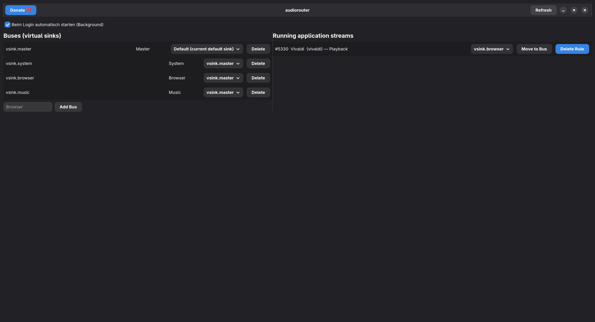

# AudioRouter

AudioRouter is a modern Linux audio routing application designed for PipeWire (and PulseAudio).
It allows you to create virtual audio sinks (buses), route them to physical output devices, and automatically assign applications to specific buses.

The application consists of a GTK-based GUI and a single-instance background daemon that applies routing rules automatically.

---

## Features

- Create and manage virtual audio sinks (buses)
- Route buses to any available output device
- Automatically route applications to specific buses
- Single-instance background daemon (no duplicate processes)
- Autostart support via GUI
- Designed for PipeWire-based desktops
- Flatpak / Flathub ready

---

## Requirements

- Linux system with PipeWire (recommended) or PulseAudio
- Flatpak
- Wayland or X11 desktop environment
- GTK-based desktop (tested on GNOME)

---

## Installation

### Installation via Flathub (recommended)

Once available on Flathub, AudioRouter can be installed with:

    flatpak install flathub de.pasuki.audiorouter

Run the application:

    flatpak run de.pasuki.audiorouter

---

### Manual Installation (from source)

Clone the repository:

    git clone https://github.com/PasukiTV/audiorouter.git
    cd audiorouter

Build and install the Flatpak locally:

    flatpak-builder --force-clean --user --install build-dir flatpak/de.pasuki.audiorouter.yml

Run AudioRouter:

    flatpak run de.pasuki.audiorouter

---

## Flathub submission (maintainer notes)

This repository now includes a Flathub-oriented manifest at:

    flatpak/de.pasuki.audiorouter.flathub.yml

Recommended release flow:

1. Create a new upstream Git tag (e.g. `v0.1.0`).
2. Update the `tag` and `commit` in the Flathub manifest (or run `scripts/prepare_flathub_release.sh <tag>`).
3. Open a PR to `flathub/flathub` with that manifest.
4. Address Flathub review feedback (permissions/sources/metadata).

A detailed checklist is available in:

    docs/flathub.md

---

## Background Daemon

AudioRouter uses a background daemon to apply audio routing rules automatically.

Start the daemon manually:

    flatpak run de.pasuki.audiorouter --background

The daemon is locked to a single instance.
Starting it multiple times will not create duplicate background processes.

---

## Companion / Stream Deck integration (SSH)

AudioRouter now supports direct sink control via CLI, which works well with
Bitfocus Companion "Generic SSH" actions.

Examples:

    # mute a virtual sink
    audiorouter --control-sink vsink.game --action mute

    # unmute a virtual sink
    audiorouter --control-sink vsink.game --action unmute

    # toggle mute
    audiorouter --control-sink vsink.game --action toggle-mute

    # absolute volume
    audiorouter --control-sink vsink.game --action set-volume --value 50%

    # relative volume (step up/down)
    audiorouter --control-sink vsink.game --action change-volume --value +5%
    audiorouter --control-sink vsink.game --action change-volume --value -5%

This lets you control individual `vsink.*` buses without custom shell scripts.
If you run AudioRouter as Flatpak, run these commands through `flatpak run`
for the app id.

### Companion custom variables (optional)

In the AudioRouter hamburger menu you can now open **Configuration → Companion**
and configure your Companion base URL and variable suffixes.

AudioRouter will then update variables via:

    POST /api/custom-variable/<variableName>/value?value=<value>

Variable name format is:

    <sinkKey><suffix>

Examples:
- `vsink.browser` + suffix `Vol` => `browserVol`
- `vsink.browser` + suffix `Mute` => `browserMute`

Mute values are sent as `1` (muted) or `0` (unmuted).
Volume values are sent as percent integer (e.g. `38`).

---

## Autostart

Autostart can be enabled from within the GUI.

When enabled, AudioRouter creates the following file:

    ~/.config/autostart/de.pasuki.audiorouter.autostart.desktop

This will automatically start the background daemon when you log in.

---

## Debugging

Check whether the background daemon is running:

    ps aux | grep audiorouter
    Stop all AudioRouter processes:
    pkill -f audiorouter

---

## License

MIT License

---

## Contributing

Contributions, bug reports and feature requests are welcome.
Please use the GitHub issue tracker for reporting problems or ideas.
